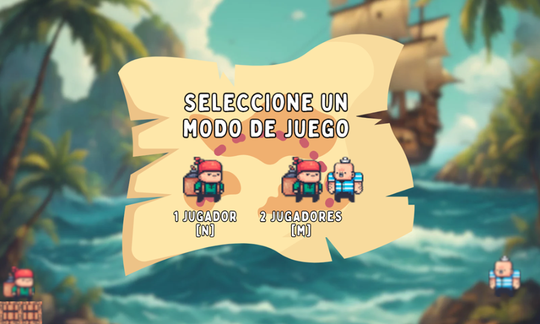

# Bomb It Pirata

## Development Team

- Andres Maximiliano  
- Nicolás Cernadas  
- Dana Cossettini Reyes  
- Catalina Correa  

## Screenshots and Presentations

  
  
  

The image down below, is a link to a _Canva Presentation_

## Game Rules / Instructions
This project is a pirate-themed game inspired by *Bomb It*, because pirates are just awesome.  
The game offers two gameplay modes: ***1 Player*** or ***2 Players***.  
The player's goal is to score as many points as possible while avoiding death.  
Points are earned by blowing things up and causing chaos in taverns, as any great pirate would.  
The player starts with 3 lives and a limited number of bombs, but these can increase by collecting specific powerups.  
The winner is the last player standing, the one with the highest score when no objects are left to destroy in the tavern, or when players run out of bombs.

### POWERUPS
Each time an object is destroyed, there is a random chance it will drop a powerup. These powerups help the player. There are 4 types:
>- ***Explosion Boost:*** Increases explosion range by 1 cell (max 3).  
>- ***Extra Life:*** Adds 1 more life (duh).  
>- ***Double Points:*** Doubles the score earned.  
>- ***Extra Bomb:*** Adds 1 more bomb (duh).  

### OBJECTS AND SCORES
>- ***Barrel:*** 50 pts  
>- ***Chair:*** 25 pts  
>- ***Blue Bottle:*** 10 pts  
>- ***Red Bottle:*** 15 pts  

## Additional Information

- Algorithms I - Universidad Nacional de San Martín (UNSAM)  
- Wollok version 0.2.11  

### Important Note
The code for this project is not included in the repository, as it is a group effort and not solely my work. However, if you would like to test it, feel free to contact me, and I'll be happy to provide it.
